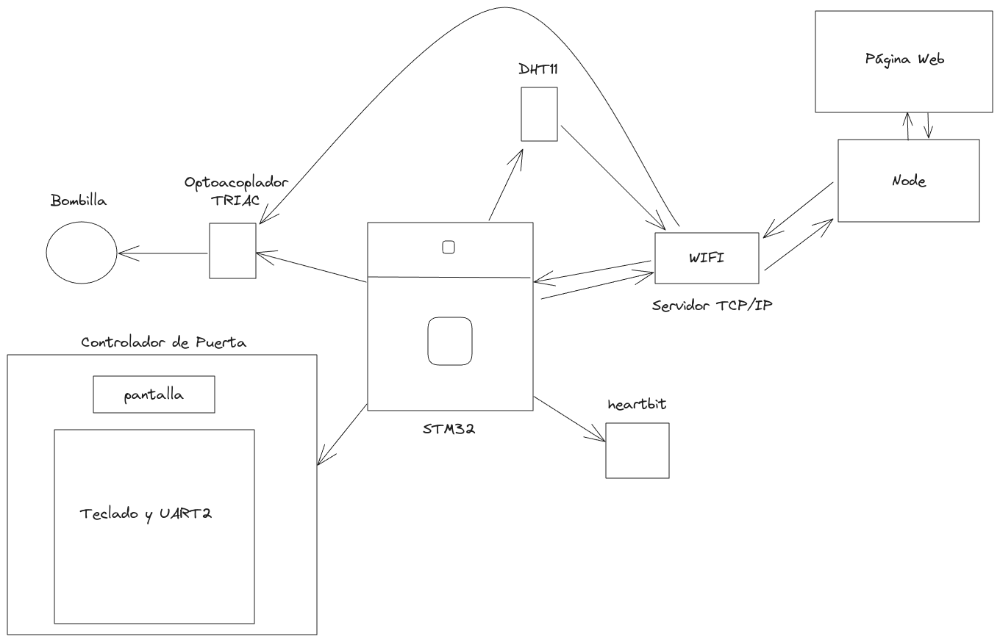
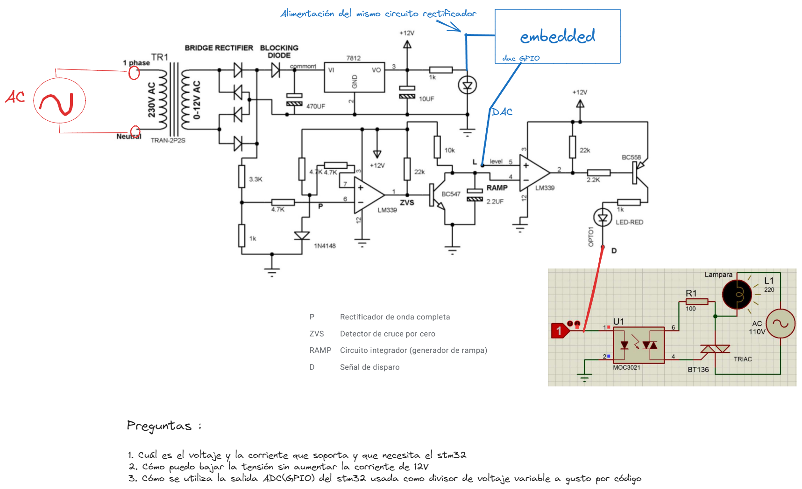
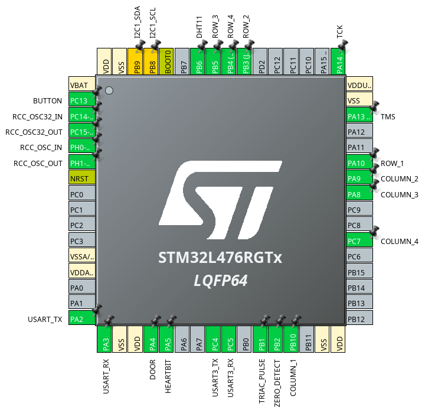

# Proyecto_Final_Estructuras

Estructura del proyecto:



Más información acerca del circuito de cruce por cero + TRIAC:



Pines del embebido:



Cómo correr página web:

```bash
#En carpeta Web-page
npm install
npm run dev
```
